# Console plant vs zombie 

本项目实现一个命令行下的简化版植物大战僵尸(plant vs zombie)游戏

程序只能在linux环境下的**256色**终端运行（部分终端不支持256色，无法正常显示游戏界面）。

游戏界面截图：

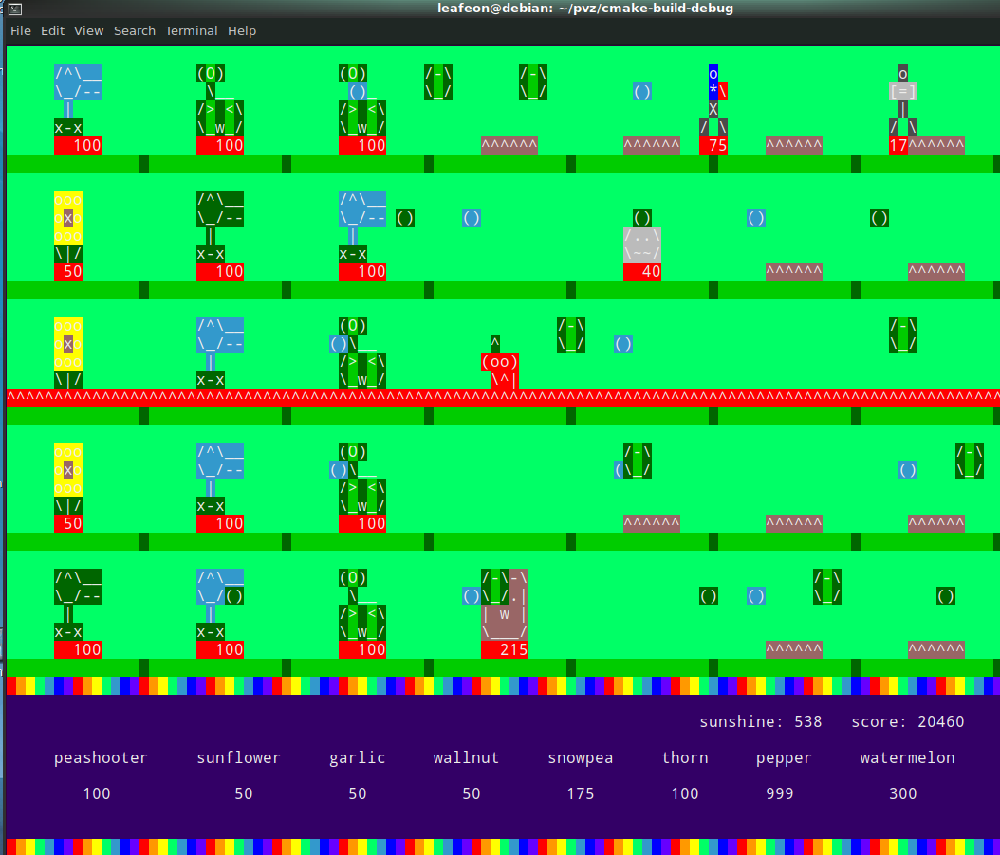

**运行方式**

直接执行`./pvz`即可

**操作方法**

按B键进入商店，此时商店内会出现白色光标进行选择，按A键或D键可以控制光标左右移动，按X键退出：

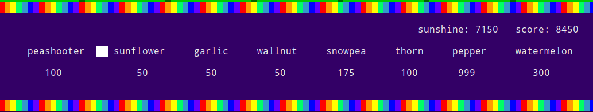

按enter键选中植物，之后白色光标会移动至上方草地区域，通过W、S、A、D键可以控制光标进行上下左右移动，按X键退出，选择想要种植的格子后按enter键即可种植植物：

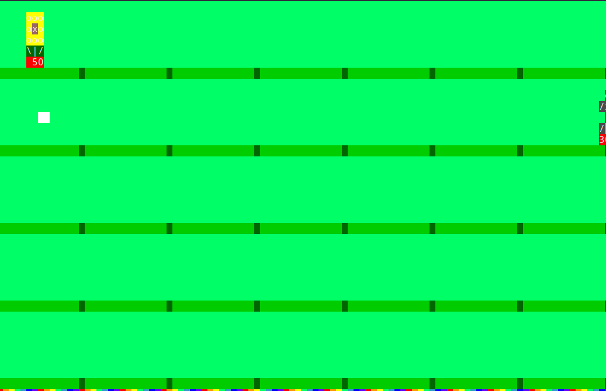

注意：若此时持有的阳光数量不足以种植选中的植物或被选中的格子已经种了植物了，则按下enter键后操作无效，什么也不会发生。

在未进入商店时，按C键进入铲除模式。此时草坪区域中出现白色光标，同样通过W、A、S、D移动光标至想要铲除的植物所在的格子后，按enter即可铲除植物。若想放弃铲除，则按C键退出。

**植物图鉴**

01 豌豆射手 peashooter

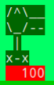

HP: 100

ATK: 30

COST: 100

pvz最普通也最具代表性的植物之一，发射豌豆对前方的僵尸造成伤害。

02 向日葵 sunflower

HP: 50

ATK: 0

COST: 50

最具代表性的植物之二，能定期自动产生阳光。

03 大蒜 garlic

HP: 40 (PS：一开始HP不止40然而发现种一列大蒜就无敌了orz所以把HP给削了)

ATK: 0

COST: 50 

僵尸吃一口就会因为其恶臭而向上或向下移动到相邻的行。

04 坚果墙 wallnut

|    HP充足时的样子     |    HP不足时的亚子     |
| :-------------------: | :-------------------: |
| 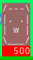 |  |

HP: 500

ATK:0

COST: 50

牺牲我自己，保护千万家。抵挡僵尸的坚固盾牌。

05 寒冰射手 snowpea

HP: 100 

ATK: 35

COST: 175

能够发射具有减速效果的冰豌豆。僵尸被冰豌豆击中后会减速并在体表呈现蓝色。

|    鲜活的僵尸     | 被冰豌豆击中后减速的僵尸 |
| :---------------: | :----------------------: |
| 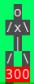 |       |

06 地刺 thorn

ATK: 25

COST: 100

不会被僵尸啃食的植物，会对踩在其上的所有僵尸造成伤害。

07 火爆辣椒 pepper

COST: 999

让一行的所有僵尸当场去世。因为效果太暴力严重破坏游戏平衡所以把所需阳光数从原作的125提到了999.

天 降 正 义：

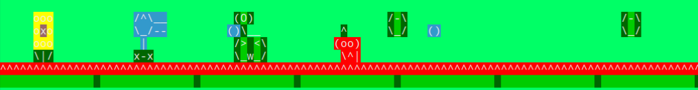

08 西瓜投手 watermelon

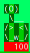

HP: 100

ATK: 80

COST: 300

高配版的豌豆射手，花费更多阳光的同时有着更高的攻击力。

**僵尸图鉴**

注：僵尸在低HP时会发生掉胳膊等现象，这里只展示完整的僵尸图片。

01 僵尸

HP: 300

ATK: 10

移动速度：正常

击杀加分：100

寻常无奇的僵尸。为了（不存在的）脑子向你的屏幕左侧不懈移动着。

02 路障僵尸

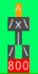

HP：800

ATK: 10

移动速度：正常

击杀加分：300

头上有橙色路障保护的僵尸。HP降到300以下时，头上的路障会被打掉，变成普通僵尸的样子。

03 摇旗僵尸

(摇旗僵尸为左一，其后为其带领的僵尸大军)

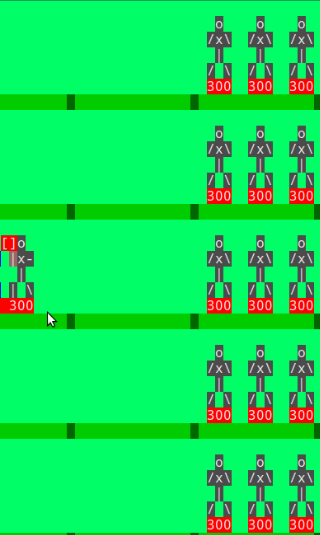

HP: 300

ATK: 10

移动速度： 快

击杀加分：150

冲锋在前的僵尸，速度快。出现摇旗僵尸说明大波的僵尸阵列要 来 了。

04 橄榄球僵尸

HP: 900

ATK: 15

移动速度：快

击杀加分：666

你最不想见到的僵尸之一。皮厚防高速度快，自身的护甲能够使得植物造成的伤害降到1/3.

05 读报僵尸

HP: 400

ATK: 10

移动速度：

报纸被打掉前：正常

报纸被打掉后：快

击杀加分：200

沉迷学习的僵尸。手中的~~本子~~报纸被打烂后会陷入狂怒从而速度加快。

06 舞王僵尸

HP: 500

ATK: 10

移动速度：正常

击杀加分：300

双手会左右摇摆的舞王僵尸。会定期在上下左右四个格子召唤伴舞僵尸。

07 伴舞僵尸

(围绕着舞王僵尸的四只，左边那只被冰豌豆击中了)

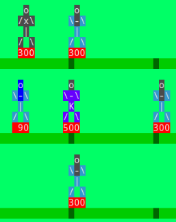

HP: 300

ATK: 10

移动速度：正常

击杀加分：100

双手也会左右摇摆的僵尸。被舞王僵尸召唤出来的小伙伴，可以越过坚果墙等防线出现在出其不意的位置。

